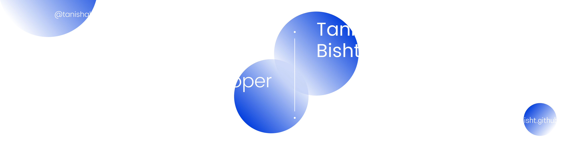

<div style='background-color:#444c56;padding:2rem'>

# Hello World! This Is Tanisha

##  A little more about me...  

```javascript
const tani = {
  pronouns: "she" | "her",
  language: [ 'Javascript', 'HTML', 'CSS', 'Python', 'Cpp', 'C' ],
  terminalCommands: [ 'git', 'linux' ],
  architecture: ["simple page application"],
  techCommunities: {
    member: "SRM Next Tech Lab",
    member: "SRM SCRO"
  },
  latestInterests: [ 'linux', 'Operating Systems', 'Computer Networking' ],
  technologies: {
    backend: {
      javascript: [ 'node JS', 'experss JS' ]
    },
    frontend: {
      javascript: [ 'React', 'Angular', 'NextJS' ],
      CSS: [ 'Sass', 'Bootstrap', 'Materialize', 'Tailwind CSS', 'Styled Components' ]
    },
    webScraping: {
      python: [ 'Beautiful Soup', 'Selenium' ]
    },
    missc: [ 'gitHub', 'Tkinter' ]
  }
}
```

<br><br>
<table>
  <tr>
    <td><h3>My Projects ✏️</h3></td>
    <td>
      🌪️ Angular-Beginner-Website (<a href="https://github.com/tanishabisht/Angular-Beginner-Website">repo</a>) - A website made using Angular that covers all the basic concepts to get started with angular<br>
      📖 <a href="https://tanishabisht.github.io/CaffeineOverflow-FrontEnd/#/home">Eureka</a> (<a href="https://github.com/tanishabisht/CaffeineOverflow-FrontEnd">repo</a>) - Getting out of ideas? This application lists and filters based on your requirements<br>
      🛒 <a href="https://tanishabisht.github.io/Jayvardhan-Portfolio/#/home">Portfolio Template 1</a> (<a href="https://github.com/tanishabisht/Jayvardhan-Portfolio">repo</a>)<br>
      🛒 <a href="https://tanishabisht.github.io/Eeshan-Portfolio/">Portfolio Template 2</a> (<a href="https://github.com/tanishabisht/Eeshan-Portfolio">repo</a>)
    </td>
  </tr>
</table>
<br><br>


<p style='text-align:center'>Connect with me<br>
  <a href='#'>Resume</a> |
  <a href='https://www.linkedin.com/in/tanisha-bisht/'>LinkedIn</a> |
  <a href='https://medium.com/@tanisha.bisht2020'>Medium</a> |
  <a href='#'>npx</a> |
  <a href='https://stackoverflow.com/users/15961606/tanisha-bisht'>Stack Overflow</a>
</p>
</div>